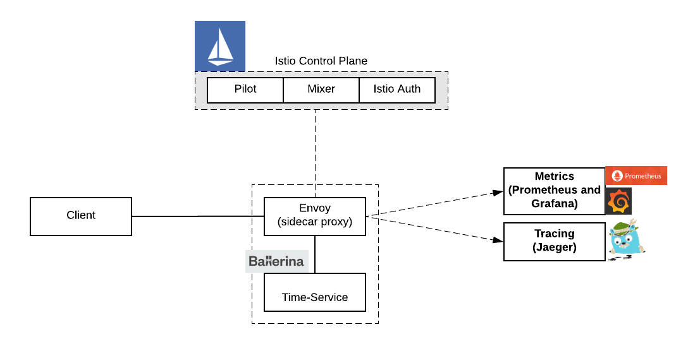
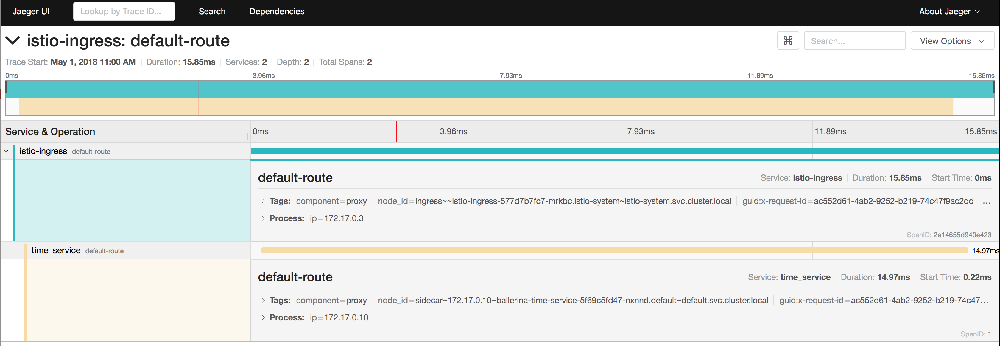
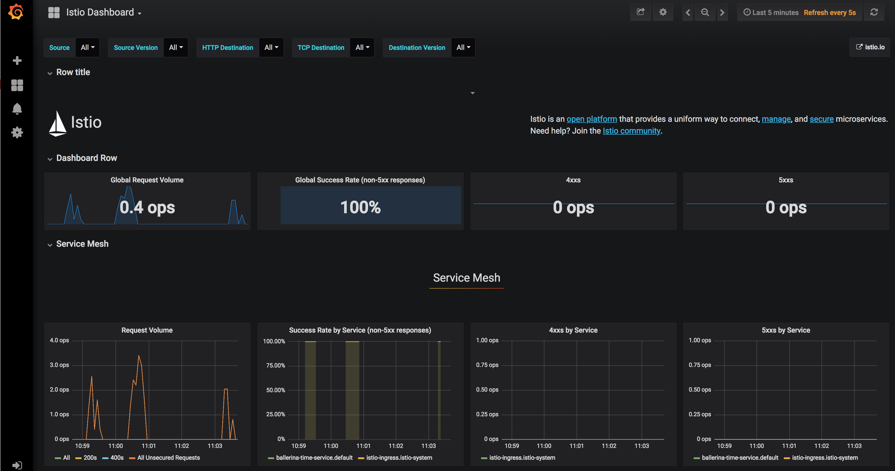
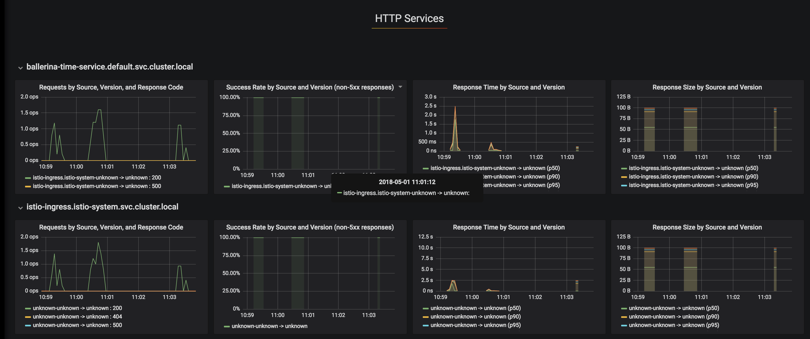

# Running Ballerina with Istio 
[Istio](https://istio.io/) provides an easy way to create a network of deployed services with load balancing, service-to-service authentication, monitoring, and more, without requiring any changes in service code. 

> In this guide you will learn about building a Ballerina service and deploying it on Istio service mesh.  

The following are the sections available in this guide.

- [What you'll build](#what-youll-build)
- [Prerequisites](#prerequisites)
- [Implementation](#implementation)
- [Testing](#testing)
- [Deployment](#deployment)
- [Observability](#observability)

## What you’ll build 
In this guide, you will build a simple Ballerina service that gives the current time and we'll deploy that service on Istio. 
We will deploy this service alongside Istio's Envoy sidecar and we'll use observability capabilities of Istio so that we can observe our Ballerina service using Grafana and Jaegar. 


The Ballerina service is exposed via the sidecar proxy and client access the service via the sidecar. All the metrics and tracing related activities are enforced at the sidecar and they are transparent to the service code.

## Prerequisites
 
- [Ballerina Distribution](https://ballerina.io/learn/getting-started/)
- A Text Editor or an IDE 
- [Docker](https://docs.docker.com/engine/installation/)
- [Install Kubernetes.](https://kubernetes.io/docs/setup/)  
- [Istio installation](https://istio.io/docs/setup/kubernetes/quick-start.html). 
- [Install Jaegar and Grafana addons](https://istio.io/docs/tasks/telemetry/distributed-tracing.html) for Istio. 


### Optional requirements
- Ballerina IDE plugins ([IntelliJ IDEA](https://plugins.jetbrains.com/plugin/9520-ballerina), [VSCode](https://marketplace.visualstudio.com/items?itemName=WSO2.Ballerina), [Atom](https://atom.io/packages/language-ballerina))

## Implementation

- As the first step you can build a Ballerina service that gives the current time as the output. You can simply create a file `` time_service.bal`` and add the 
following content to the service code.

##### time_service.bal
```ballerina
import ballerina/http;
import ballerina/io;
import ballerina/time;

endpoint http:Listener listener {
    port:9095
};

@http:ServiceConfig {basePath:"/localtime"}
service<http:Service> time bind listener {
    @http:ResourceConfig{
        path: "/",  methods: ["GET"]
    }
    sayHello (endpoint caller, http:Request request) {
        http:Response response = new;
        time:Time currentTime = time:currentTime();
        string customTimeString = currentTime.format("yyyy-MM-dd'T'HH:mm:ss");
        json timeJ = {currentTime : customTimeString };
        response.setJsonPayload(timeJ);
        _ = caller -> respond(response);
    }
}
```

- Now you can add the Kubernetes annotations that are required to generate the Kubernetes deployment artifacts. 

##### time_service.bal
```ballerina
import ballerina/http;
import ballerina/io;
import ballerina/time;
import ballerinax/kubernetes;


@kubernetes:Ingress {
    name:"ballerina-time-service",
    path:"/localtime",
    ingressClass:"istio"
}

@kubernetes:Service {
    serviceType:"NodePort",
    name:"ballerina-time-service"
}
endpoint http:Listener listener {
    port:9095
};


@kubernetes:Deployment {
    image: "ballerina-time-service",
    name: "ballerina-time-service",
    dockerHost:"tcp://192.168.99.100:2376",
    dockerCertPath:"/<Home Dir>/.minikube/certs"
}

@http:ServiceConfig {basePath:"/localtime"}
service<http:Service> time bind listener {
    @http:ResourceConfig{
        path: "/",  methods: ["GET"]
    }
    sayHello (endpoint caller, http:Request request) {
        http:Response response = new;
        time:Time currentTime = time:currentTime();
        string customTimeString = currentTime.format("yyyy-MM-dd'T'HH:mm:ss");
        json timeJ = {currentTime : customTimeString };
        response.setJsonPayload(timeJ);
        _ = caller -> respond(response);
    }
}
```

- Please note that we have to override the default Ingress class to `` ingressClass:"istio"`` and if you are using Minikube, you need to specify ``dockerHost``  and ``dockerCertPath`` in you 
deployment annotations.
- Then you can build the Ballerina service using ``$ ballerina build time_service.bal``. You should be able to see the following output. 


```` 
4ballerina build time_service.bal
@kubernetes:Service 			 - complete 1/1
@kubernetes:Ingress 			 - complete 1/1
@kubernetes:Docker 			 - complete 3/3
@kubernetes:Deployment 			 - complete 1/1

Run following command to deploy kubernetes artifacts:
kubectl apply -f /Users/kasun/Dev/Source/git/kasun04/ballerina-guides/using-kubernetes/src/kubernetes/
````
                                                                                                                                        
- By default Ballerina build creates Kubernetes artifacts in multiple .yaml files. For Istio we need to have a single file with all the artifacts. 
Hence you can simply create a new file and copy the content of all he generated artifacts to it. For example you can refer [time_service_all_in_one.yaml](./kubernetes/time_service_all_in_one.yaml). 
- Before deploying the service on Istio, you need to do few modifications to the deployment descriptors. 
- Update ingress definition : Please remove `` host: "listener.com"`` and ``tls - hosts: [] :`` section. 
And also make sure that Ingress class is set to `` kubernetes.io/ingress.class: "istio"`` and remove ``nginx.ingress.kubernetes.io/ssl-passthrough: "false"`` if exists. 
- Update service definition : Please update ``protocol: "TCP"`` to ``name: "http"``. 
- Please refer [time_service_all_in_one.yaml](./kubernetes/time_service_all_in_one.yaml) which contains all the aforementioned changes. 

- Now you are all set to deploy your Ballerina service on Istio. To do that you need to inject the sidecar into your service's deployment descriptors. You can do that by executing: 

``` 
$istioctl kube-inject -f all-in-one.yaml -o time_service_k8s_istio_injected.yaml
```
- Finally you can deploy the Istio sidecar injected service with: 
``` 
$ kubectl apply -f time_service_k8s_istio_injected.yaml 
```

- You can verify the deployment by checking the pod, service and ingress. Also, you can verify that your service is running along with a Istio sidecar proxy by `` ubectl describe pod < include your ballerina-time-service pod name>``. 

## Testing 


- You can run invoke the Ballerina service that we have deployed above, via Istio. 
- If you are running Istio on Minikube you need to find the findout the ingress url of Istio to access your service. 
For that you have to determine the Minikube host name (you can find this with $minikube ip) and the NodePort for Istio ingress using `` kubectl get svc istio-ingress -n istio-system -o 'jsonpath={.spec.ports[0].nodePort}'``. 
Then you can access the Ballerina service as follows. 

``` 
$curl http://<minikube_ip>:<istio_ingress_node_port>/localtime
{"currentTime":"2018-05-01T21:47:53"}
``` 

- If you are using docker for mac you should be able to access it via ``http://localhost/localtime``. 


## Observability 
Now you can use Istio's observability capabilities to observer your Ballerina service. 

### Distributed Tracing with Jaeger 
- To enable distributed tracing, you need to install the Jaeger addon for Istio as mentioned in the prerequisites section. 
- Then setup port-forwarding with `` kubectl port-forward -n istio-system $(kubectl get pod -n istio-system -l app=jaeger -o jsonpath='{.items[0].metadata.name}') 16686:16686 &
``. 
- Now you can access Jaeger with `` http://localhost:16686/search``. 
- You should be able to see the tracers for your Ballerina time-service as shown below. 

- Also you can drill down further to see that traffic is flowing through the Istio sidecar to the Ballerina service. 



### Metrics with Istio Dashboard on Grafana  
- You can install the Grafana and Prometheus addons as mentioned in the prerequisites section. 
- Once you have added it, the setup port-forwarding with `` kubectl -n istio-system port-forward $(kubectl -n istio-system get pod -l app=grafana -o jsonpath='{.items[0].metadata.name}') 3000:3000 &``. 
- Now you can access the Istio Dashboard via `` http://localhost:3000/dashboard/db/istio-dashboard``. 
- You can observer the metrics for your Ballerina service as shown below. 



