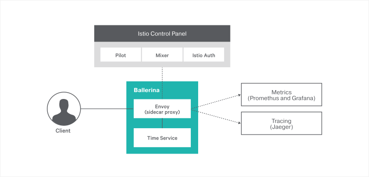

[](https://travis-ci.org/ballerina-guides/ballerina-with-istio)

# Running Ballerina with Istio 
[Istio](https://istio.io/) provides an easy way to create a network of deployed services with load balancing, service-to-service authentication, monitoring, and more, without requiring any changes in service code. 

> In this guide you will learn about building a Ballerina service and deploying it on Istio service mesh.  

The following are the sections available in this guide.

- [What you'll build](#what-youll-build)
- [Prerequisites](#prerequisites)
- [Implementation](#implementation)
- [Deployment](#deployment)
- [Testing](#testing)
- [Observability](#observability)

## What you’ll build 
In this guide, you will build a simple Ballerina service that gives the current time and you will deploy that service on Istio. 
This service is deployed alongside Istio's Envoy sidecar and you will use observability capabilities of Istio to observe the Ballerina service using Grafana and Jaegar. 


The Ballerina service is exposed via the sidecar proxy and the client accesses the service via the sidecar. All the metrics and tracing related activities are enforced at the sidecar and they are transparent to the service code.

## Compatibility
| Ballerina Language Version | Istio version                                                               |
| -------------------------- | --------------------------------------------------------------------------- |
| 0.991.0                    | [Istio 0.8.0 - May 2018](https://github.com/istio/istio/releases/tag/0.8.0) |

## Prerequisites
 
- [Ballerina Distribution](https://ballerina.io/learn/getting-started/)
- A Text Editor or an IDE 
> **Tip**: For a better development experience, install one of the following Ballerina IDE plugins: [VSCode](https://marketplace.visualstudio.com/items?itemName=ballerina.ballerina), [IntelliJ IDEA](https://plugins.jetbrains.com/plugin/9520-ballerina)
- [Docker](https://docs.docker.com/engine/installation/)
- [Kubernetes](https://kubernetes.io/docs/setup/)  
- [Istio](https://archive.istio.io/v0.8/docs/setup/kubernetes/quick-start/)
- [Jaegar](https://archive.istio.io/v0.7/docs/tasks/telemetry/distributed-tracing.html) and [Grafana](https://archive.istio.io/v0.7/docs/tasks/telemetry/using-istio-dashboard.html) addons for Istio

## Implementation

As the first step, you can build a Ballerina service that gives the current time as the output. You can simply create a file `time_service.bal` and add the following content to the service code.

```ballerina
import ballerina/http;
import ballerina/log;
import ballerina/time;

listener http:Listener timeEP = new(9095);

@http:ServiceConfig { basePath: "/localtime" }
service time on timeEP {
    @http:ResourceConfig {
        path: "/",
        methods: ["GET"]
    }
    resource function getTime (http:Caller caller, http:Request request) {
        time:Time currentTime = time:currentTime();
        var customTimeString = time:format(currentTime, "yyyy-MM-dd'T'HH:mm:ss");
        if (customTimeString is string) {
            json timeJ = { currentTime: customTimeString };
            var responseResult = caller->respond(timeJ);
            if (responseResult is error) {
                log:printError("Error responding back to client");
            }
        } else {
            http:Response errorResponse = new;
            json errorJson = { errorMsg: "internal server error occurred" };
            errorResponse.setPayload(errorJson);
            errorResponse.statusCode = 500;
            var responseResult = caller->respond(errorResponse);
            if (responseResult is error) {
                log:printError("Error responding back to client");
            }
        }
    }
}

```

Now you can add the Kubernetes and istio annotations that are required to generate the Kubernetes and Istio deployment artifacts. 

```ballerina
import ballerina/http;
import ballerina/log;
import ballerina/time;
import ballerinax/kubernetes;
import ballerinax/istio;

@istio:Gateway {}
@istio:VirtualService {}
@kubernetes:Service {
    name: "ballerina-time-service"
}
listener http:Listener timeEP = new(9095);

@kubernetes:Deployment {
    image: "ballerina-time-service",
    name: "ballerina-time-service"
}
@http:ServiceConfig { basePath: "/localtime" }
service time on timeEP {
    @http:ResourceConfig {
        path: "/",
        methods: ["GET"]
    }
    resource function getTime (http:Caller caller, http:Request request) {
        time:Time currentTime = time:currentTime();
        var customTimeString = time:format(currentTime, "yyyy-MM-dd'T'HH:mm:ss");
        if (customTimeString is string) {
            json timeJ = { currentTime: customTimeString };
            var responseResult = caller->respond(timeJ);
            if (responseResult is error) {
                log:printError("Error responding back to client");
            }
        } else {
            http:Response errorResponse = new;
            json errorJson = { errorMsg: "internal server error occurred" };
            errorResponse.setPayload(errorJson);
            errorResponse.statusCode = 500;
            var responseResult = caller->respond(errorResponse);
            if (responseResult is error) {
                log:printError("Error responding back to client");
            }
        }
    }
}


```

- If you are using Minikube, you need to specify `dockerHost` and `dockerCertPath` in you deployment annotations. For example, you can have the following Kubernetes annotations.
 

``` ballerina
@istio:Gateway {}
@istio:VirtualService {}
@kubernetes:Service {
    name: "ballerina-time-service"
}
listener http:Listener timeEP = new(9095);

@kubernetes:Deployment {
    image: "ballerina-time-service",
    name: "ballerina-time-service",
    dockerHost: "tcp://<minikube ip>:2376", // IP can be obtained via `minikube ip` command
    dockerCertPath: "<Home Dir>/.minikube/certs",
}
```

By default, Ballerina build creates Kubernetes artifacts in multiple .yaml files. You can override this by adding `singleYAML: true` to the Kubernetes deployment annotation of your Ballerina service, so that it creates a single Kubernetes deployment artifact. 

You can build the Ballerina service using `$ ballerina build time_service.bal`. You should be able to see the following output. 

```bash
$ ballerina build time_service.bal
Compiling source
    time_service.bal
Generating executable
    time_service.balx

	@kubernetes:Service 			 - complete 1/1
	@kubernetes:Deployment 			 - complete 1/1
	@kubernetes:Docker 			 - complete 3/3
	@kubernetes:Helm 			 - complete 1/1
	@istio:Gateway 				 - complete 1/1
	@istio:VirtualService 			 - complete 1/1

	Run the following command to deploy the Kubernetes artifacts:
	kubectl apply -f /home/ballerina-with-istio/src/kubernetes/time_service

	Run the following command to install the application using Helm:
	helm install --name ballerina-time-service /home/ballerina-with-istio/src/kubernetes/time_service/ballerina-time-service
```
    
Now you are all set to deploy your Ballerina service on Istio. To do that you need to inject the sidecar into your service's deployment descriptors. You can do that by executing the following.

```bash 
$ cd kubernetes/
$ istioctl kube-inject -f time_service.yaml -o time_service_istio_injected.yaml
```

Finally, you can deploy the Istio sidecar injected service using the following command. 

``` bash
$ kubectl apply -f time_service_istio_injected.yaml

    service/ballerina-time-service configured
    deployment.extensions/ballerina-time-service configured
    gateway.networking.istio.io/timeep-istio-gw created
    virtualservice.networking.istio.io/timeep-istio-vs created

```

You can verify the deployment by checking the pod, service, and ingress. Also, you can verify that your service is running along with a Istio sidecar proxy using `kubectl describe pod <include your ballerina-time-service pod name>`. 

## Testing 

You can invoke the Ballerina service that you have deployed above via Istio. 

If you are running on Docker for Mac Edge with Kubernetes, then you can access the service with: 
``` bash
curl http://localhost/localtime
{"currentTime":"2018-07-24T21:21:44"}
``` 

If you are on Docker with Minikube, you may use the appropriate URL to invoke the service. 
You need to follow the [instructions](https://preliminary.istio.io/docs/tasks/traffic-management/ingress.html#determining-the-ingress-ip-and-ports) to set the INGRESS_HOST and INGRESS_PORT variables. 


``` bash
export GATEWAY_URL=$INGRESS_HOST:$INGRESS_PORT
curl http://$GATEWAY_URL/localtime 

``` 

## Observability 
Now you can use Istio's observability capabilities to observe your Ballerina service. 

### Distributed Tracing with Jaeger 
- To enable distributed tracing, you need to install the Jaeger addon for Istio as mentioned in the prerequisites section. 
- Setup port-forwarding with `kubectl port-forward -n istio-system $(kubectl get pod -n istio-system -l app=jaeger -o jsonpath='{.items[0].metadata.name}') 16686:16686 &`. 
- Now you can access Jaeger at `http://localhost:16686/search`. 
- You should be able to see the tracers for your Ballerina time-service as shown below. 

- Also you can drill down further to see that traffic is flowing through the Istio sidecar to the Ballerina service. 


### Metrics with Istio Dashboard on Grafana  
- You can install the Grafana and Prometheus addons as mentioned in the prerequisites section. 
- Once you have added it, setup port-forwarding using `kubectl -n istio-system port-forward $(kubectl -n istio-system get pod -l app=grafana -o jsonpath='{.items[0].metadata.name}') 3000:3000 &`. 
- Now you can access the Istio Dashboard via `http://localhost:3000/dashboard/db/istio-dashboard`. 
- You can observe the metrics for your Ballerina service as shown below. 


